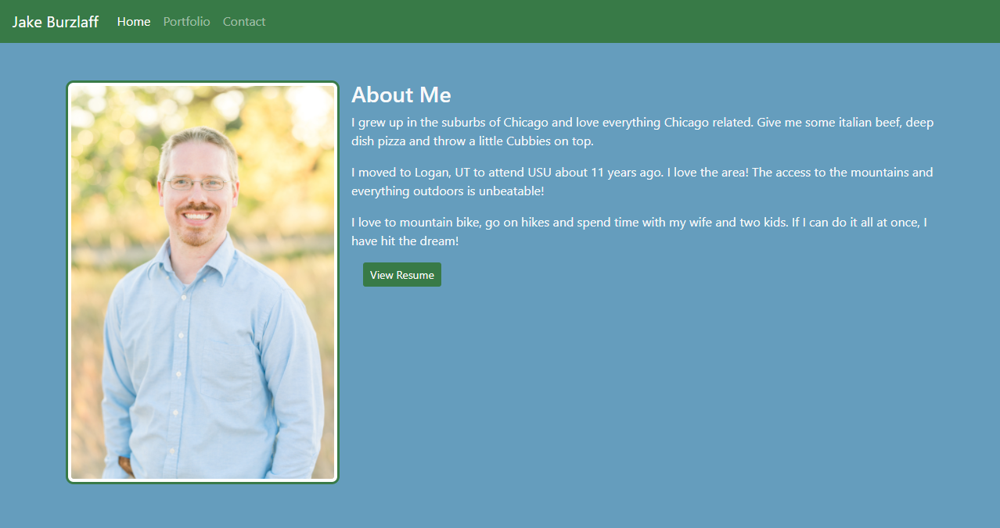

# My Portfolio

This is a website dedicated to my work as a developer.  In it you will find information about myself and the some of the projects that I have been working on developing.

Link to my [Portfolio](https://jburz.github.io)

## Languages / Frameworks
 - HTML
 - CSS Bootstrap

# Features
 - Semantic elements for accessibility
 - Responsive design to account for different screen sizes
 - Grid layout sytem via bootstrap using containers, rows and columns

 ## Credits

 This website was created by [Jake Burzlaff](https://www.github.io/jburz).
